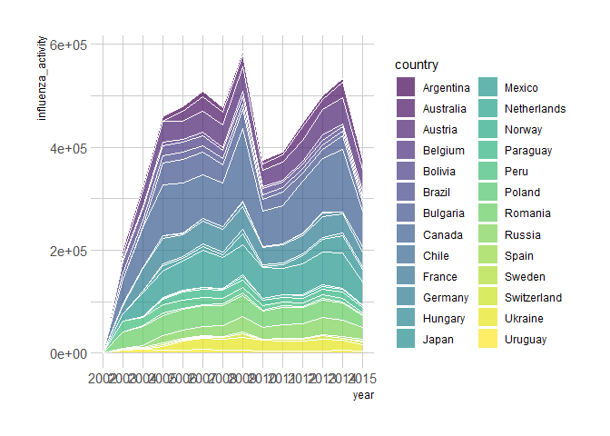
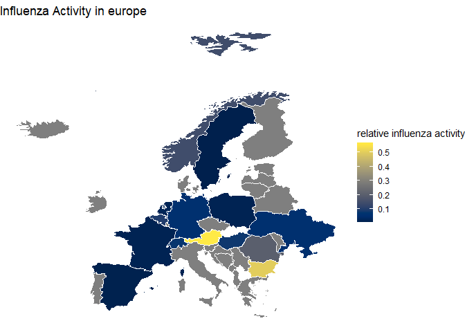
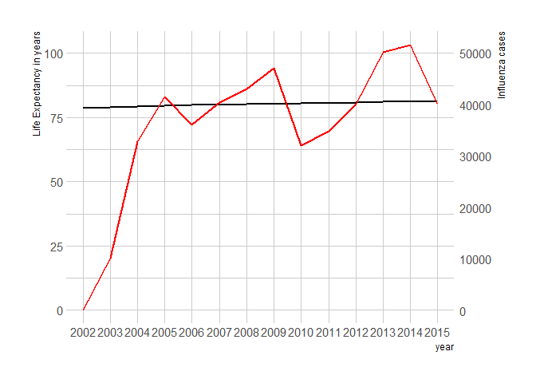

# influenzaData

## Installation

you can install the development version from
[GitHub](https://github.com/) with:

``` r
# install.packages("devtools")
devtools::install_github("Larsdegroot/influenzaData")
```

## Example

``` r
library(influenzaData)
library(ggplot2)
library(tidyverse)
#> -- Attaching packages --------------------------------------- tidyverse 1.3.1 --
#> v tibble  3.1.2     v dplyr   1.0.6
#> v tidyr   1.1.3     v stringr 1.4.0
#> v readr   1.4.0     v forcats 0.5.1
#> v purrr   0.3.4
#> -- Conflicts ------------------------------------------ tidyverse_conflicts() --
#> x dplyr::filter() masks stats::filter()
#> x dplyr::lag()    masks stats::lag()
library(kableExtra)
#> 
#> Attaching package: 'kableExtra'
#> The following object is masked from 'package:dplyr':
#> 
#>     group_rows
library(viridis)
#> Loading required package: viridisLite
library(hrbrthemes)
#> NOTE: Either Arial Narrow or Roboto Condensed fonts are required to use these themes.
#>       Please use hrbrthemes::import_roboto_condensed() to install Roboto Condensed and
#>       if Arial Narrow is not on your system, please see https://bit.ly/arialnarrow
```

The joined dataset contains data about
`R joined_gapfluden["country"] %>% unique() %>% count() %>% pull()`
different countries, during the time period from
`R joined_gapfluden["year"] %>% min` until
`R joined_gapfluden["year"] %>% max`. And also the influenza cases per
country during this time.

``` r
joined_gapfluden$country <- joined_gapfluden$country %>% as.factor()
joined_gapfluden$year <- joined_gapfluden$year %>% as.factor()
joined_gapfluden$continent <- joined_gapfluden$continent %>% as.factor()
joined_gapfluden$region <- joined_gapfluden$region %>% as.factor()
```

``` r
kableExtra::kable(head(joined_gapfluden))
```

<table>
<thead>
<tr>
<th style="text-align:left;">
country
</th>
<th style="text-align:left;">
year
</th>
<th style="text-align:right;">
infant\_mortality
</th>
<th style="text-align:right;">
life\_expectancy
</th>
<th style="text-align:right;">
fertility
</th>
<th style="text-align:right;">
population
</th>
<th style="text-align:right;">
gdp
</th>
<th style="text-align:left;">
continent
</th>
<th style="text-align:left;">
region
</th>
<th style="text-align:right;">
influenza\_activity
</th>
<th style="text-align:right;">
dengue\_activity
</th>
</tr>
</thead>
<tbody>
<tr>
<td style="text-align:left;">
Argentina
</td>
<td style="text-align:left;">
2002
</td>
<td style="text-align:right;">
17.1
</td>
<td style="text-align:right;">
74.3
</td>
<td style="text-align:right;">
2.38
</td>
<td style="text-align:right;">
37889443
</td>
<td style="text-align:right;">
242076212334
</td>
<td style="text-align:left;">
Americas
</td>
<td style="text-align:left;">
South America
</td>
<td style="text-align:right;">
0
</td>
<td style="text-align:right;">
0.000
</td>
</tr>
<tr>
<td style="text-align:left;">
Australia
</td>
<td style="text-align:left;">
2002
</td>
<td style="text-align:right;">
5.0
</td>
<td style="text-align:right;">
80.3
</td>
<td style="text-align:right;">
1.76
</td>
<td style="text-align:right;">
19514385
</td>
<td style="text-align:right;">
442135393399
</td>
<td style="text-align:left;">
Oceania
</td>
<td style="text-align:left;">
Australia and New Zealand
</td>
<td style="text-align:right;">
0
</td>
<td style="text-align:right;">
NA
</td>
</tr>
<tr>
<td style="text-align:left;">
Austria
</td>
<td style="text-align:left;">
2002
</td>
<td style="text-align:right;">
4.4
</td>
<td style="text-align:right;">
78.8
</td>
<td style="text-align:right;">
1.39
</td>
<td style="text-align:right;">
8114698
</td>
<td style="text-align:right;">
196998621885
</td>
<td style="text-align:left;">
Europe
</td>
<td style="text-align:left;">
Western Europe
</td>
<td style="text-align:right;">
0
</td>
<td style="text-align:right;">
NA
</td>
</tr>
<tr>
<td style="text-align:left;">
Belgium
</td>
<td style="text-align:left;">
2002
</td>
<td style="text-align:right;">
4.4
</td>
<td style="text-align:right;">
78.2
</td>
<td style="text-align:right;">
1.68
</td>
<td style="text-align:right;">
10364613
</td>
<td style="text-align:right;">
237741668285
</td>
<td style="text-align:left;">
Europe
</td>
<td style="text-align:left;">
Western Europe
</td>
<td style="text-align:right;">
0
</td>
<td style="text-align:right;">
NA
</td>
</tr>
<tr>
<td style="text-align:left;">
Bolivia
</td>
<td style="text-align:left;">
2002
</td>
<td style="text-align:right;">
53.7
</td>
<td style="text-align:right;">
68.7
</td>
<td style="text-align:right;">
3.98
</td>
<td style="text-align:right;">
8653343
</td>
<td style="text-align:right;">
8751510220
</td>
<td style="text-align:left;">
Americas
</td>
<td style="text-align:left;">
South America
</td>
<td style="text-align:right;">
0
</td>
<td style="text-align:right;">
0.101
</td>
</tr>
<tr>
<td style="text-align:left;">
Brazil
</td>
<td style="text-align:left;">
2002
</td>
<td style="text-align:right;">
24.3
</td>
<td style="text-align:right;">
71.4
</td>
<td style="text-align:right;">
2.26
</td>
<td style="text-align:right;">
181045592
</td>
<td style="text-align:right;">
670512665737
</td>
<td style="text-align:left;">
Americas
</td>
<td style="text-align:left;">
South America
</td>
<td style="text-align:right;">
174
</td>
<td style="text-align:right;">
0.073
</td>
</tr>
</tbody>
</table>

Influenza, commonly called the flu, is an infectious disease caused by
The influenza virus. Symptoms can be quite mild; fever, runny nose, sore
throat. Or severe pneumonia.

in 2009 a strain of influenza, the H1N1 influenza strain caused a
pandemic known as the swine flu.

``` r
joined_gapfluden %>% 
  ggplot(aes(x= year, y = influenza_activity, group = country, fill = country)) +
  geom_area(alpha = 0.7, size = 0.4, colour = "white") +
  theme_ipsum() + #or theme_ft_rc()
  scale_fill_viridis(discrete = T)
#> Warning: Removed 2226 rows containing missing values (position_stack).
#> Warning in grid.Call(C_stringMetric, as.graphicsAnnot(x$label)): font family not
#> found in Windows font database

#> Warning in grid.Call(C_stringMetric, as.graphicsAnnot(x$label)): font family not
#> found in Windows font database
#> Warning in grid.Call(C_textBounds, as.graphicsAnnot(x$label), x$x, x$y, : font
#> family not found in Windows font database
#> Warning in grid.Call(C_stringMetric, as.graphicsAnnot(x$label)): font family not
#> found in Windows font database
#> Warning in grid.Call(C_textBounds, as.graphicsAnnot(x$label), x$x, x$y, : font
#> family not found in Windows font database

#> Warning in grid.Call(C_textBounds, as.graphicsAnnot(x$label), x$x, x$y, : font
#> family not found in Windows font database

#> Warning in grid.Call(C_textBounds, as.graphicsAnnot(x$label), x$x, x$y, : font
#> family not found in Windows font database

#> Warning in grid.Call(C_textBounds, as.graphicsAnnot(x$label), x$x, x$y, : font
#> family not found in Windows font database

#> Warning in grid.Call(C_textBounds, as.graphicsAnnot(x$label), x$x, x$y, : font
#> family not found in Windows font database

#> Warning in grid.Call(C_textBounds, as.graphicsAnnot(x$label), x$x, x$y, : font
#> family not found in Windows font database
#> Warning in grid.Call.graphics(C_text, as.graphicsAnnot(x$label), x$x, x$y, :
#> font family not found in Windows font database
#> Warning in grid.Call(C_textBounds, as.graphicsAnnot(x$label), x$x, x$y, : font
#> family not found in Windows font database

#> Warning in grid.Call(C_textBounds, as.graphicsAnnot(x$label), x$x, x$y, : font
#> family not found in Windows font database
```



Global cases peaked in 2009 at 586671.

Some countries had more influenza cases realtive to their population
during the peak than others.

``` r
relative_influenza_2009 <- joined_gapfluden %>% 
  filter(continent == "Europe", year == "2009") %>% 
  select(country, population, influenza_activity) %>% 
  mutate(relative_influenza_cases = (influenza_activity / population)*100)

regions <- relative_influenza_2009$country
#remove Russia because it takes up too much space in the map
regions <- regions[-11]

map_data_eu <- map_data("world", region = regions)

relative_influenza_2009 <- relative_influenza_2009 %>% filter(country != "Russia")
#renaming for left join
relative_influenza_2009 <- rename(relative_influenza_2009, region = country)
map_data_eu <- left_join(relative_influenza_2009, map_data_eu, by = "region")

ggplot(map_data_eu, aes(x = long, y = lat)) +
  geom_polygon(aes(group = group, fill = relative_influenza_cases), colour = "white", size = 0.1) +
  theme_void() + #maybe a dark theme?
  scale_fill_viridis(option = "E") + 
  labs(title = "Influenza Activity in europe",
       fill = "relative influenza activity")
```



It is visible that Austria was had a relatively high influenza activity.
Could this have effected life expectancy in Austria?

``` r
joined_gapfluden %>%
  filter(country == "Austria") %>%
  ggplot() +
  geom_line(aes(x = year, y = life_expectancy), group = 1, size = 1) +
  geom_line(aes(x = year, y = influenza_activity/500), group = 1, inherit.aes = F, size = 1, color = "red") +
  scale_y_continuous(
    name = "Life Expectancy in years",
    sec.axis = sec_axis(~.*500, name = "Influenza cases")
  ) +
  theme_ipsum()
#> Warning in grid.Call(C_textBounds, as.graphicsAnnot(x$label), x$x, x$y, : font
#> family not found in Windows font database

#> Warning in grid.Call(C_textBounds, as.graphicsAnnot(x$label), x$x, x$y, : font
#> family not found in Windows font database

#> Warning in grid.Call(C_textBounds, as.graphicsAnnot(x$label), x$x, x$y, : font
#> family not found in Windows font database

#> Warning in grid.Call(C_textBounds, as.graphicsAnnot(x$label), x$x, x$y, : font
#> family not found in Windows font database

#> Warning in grid.Call(C_textBounds, as.graphicsAnnot(x$label), x$x, x$y, : font
#> family not found in Windows font database

#> Warning in grid.Call(C_textBounds, as.graphicsAnnot(x$label), x$x, x$y, : font
#> family not found in Windows font database

#> Warning in grid.Call(C_textBounds, as.graphicsAnnot(x$label), x$x, x$y, : font
#> family not found in Windows font database

#> Warning in grid.Call(C_textBounds, as.graphicsAnnot(x$label), x$x, x$y, : font
#> family not found in Windows font database

#> Warning in grid.Call(C_textBounds, as.graphicsAnnot(x$label), x$x, x$y, : font
#> family not found in Windows font database
#> Warning in grid.Call.graphics(C_text, as.graphicsAnnot(x$label), x$x, x$y, :
#> font family not found in Windows font database
#> Warning in grid.Call(C_textBounds, as.graphicsAnnot(x$label), x$x, x$y, : font
#> family not found in Windows font database
#> Warning in grid.Call.graphics(C_text, as.graphicsAnnot(x$label), x$x, x$y, :
#> font family not found in Windows font database
```


